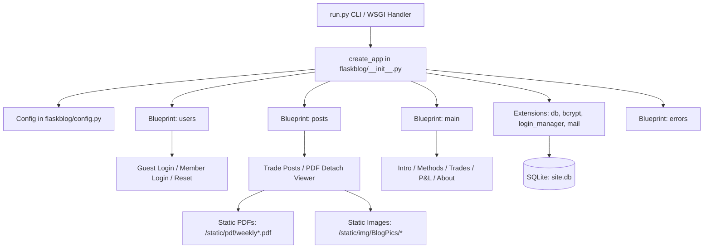
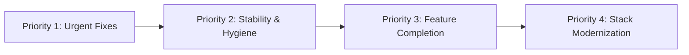

# WebBlog Codebase & Architecture Analysis

## 1. Executive Summary

**WebBlog** is a Python Flask web application tailored as an active trading journal, methodology reference, and performance log for **E-Micro Futures (MNQ)** trading on the CME. Originally derived from the standard Corey Schafer Flask application architecture, it has been substantially customized with:
- A specialized **Weekly Trade Log & Teaser** data pipeline.
- A dedicated, decoupled **PDF trade chart viewer** (`detach_viewer.html` & `embed_viewer.html`) with dynamic browser-specific zoom/fit parameters.
- A dual-tiered authentication system distinguishing **Guest Visitors** from **Members / Authors**.
- A custom 930+ line **Tkinter Git Automation GUI** (`git_push.py`) with automatic rollbacks for local and remote repositories.
- Deployment support for **PythonAnywhere** (`evers.pythonanywhere.com`).
- A live SQLite database (`site.db`) holding **170+ trade logs** actively maintained up through September 2026.

---

## 2. System Architecture & Component Inventory



### Directory & File Structure

| Component | Path | Responsibility |
| :--- | :--- | :--- |
| **Application Runner** | [`run.py`](file:///C:/Users/evers/Documents/GitHub/WebBlog/run.py) | Parses command-line flags (`-port`, `-debug`, `-fdt`, `-fdt_redirect`) and starts the server. |
| **App Factory** | [`flaskblog/__init__.py`](file:///C:/Users/evers/Documents/GitHub/WebBlog/flaskblog/__init__.py) | Initializes Flask extensions and registers modular blueprints. |
| **Configuration** | [`flaskblog/config.py`](file:///C:/Users/evers/Documents/GitHub/WebBlog/flaskblog/config.py) | Defines database URI, application secrets, and email SMTP parameters. |
| **Data Models** | [`flaskblog/models.py`](file:///C:/Users/evers/Documents/GitHub/WebBlog/flaskblog/models.py) | Defines `User` and `Post` database tables and token generation. |
| **Users Blueprint** | [`flaskblog/users/`](file:///C:/Users/evers/Documents/GitHub/WebBlog/flaskblog/users/) | Login routing, registration, profile updates (Pillow image thumbnailing), password resets. |
| **Posts Blueprint** | [`flaskblog/posts/`](file:///C:/Users/evers/Documents/GitHub/WebBlog/flaskblog/posts/) | Trade blog entries, CRUD handlers, and specialized PDF viewers. |
| **Main Blueprint** | [`flaskblog/main/`](file:///C:/Users/evers/Documents/GitHub/WebBlog/flaskblog/main/) | Informational pages (`intro`, `methods`, `trades`, `pnl`, `about`). |
| **Error Handlers** | [`flaskblog/errors/`](file:///C:/Users/evers/Documents/GitHub/WebBlog/flaskblog/errors/) | Custom Jinja2 error pages for HTTP 403, 404, and 500. |
| **Git Tooling** | [`git_push.py`](file:///C:/Users/evers/Documents/GitHub/WebBlog/git_push.py) | Custom Tkinter desktop GUI for step-by-step git staging, committing, pushing, and rollbacks. |
| **WSGI Configuration** | [`# This file contains...`](file:///C:/Users/evers/Documents/GitHub/WebBlog/%23%20This%20file%20contains%20the%20WSGI%20configuration%20require.py) | PythonAnywhere web service entry point loading `run.app as application`. |

---

## 3. Database Schema & Data Models

Defined in [`flaskblog/models.py`](file:///C:/Users/evers/Documents/GitHub/WebBlog/flaskblog/models.py):

### 3.1 `User` Model
- `id` (`Integer`, Primary Key)
- `username` (`String(20)`, Unique, Not Null)
- `email` (`String(120)`, Unique, Not Null)
- `image_file` (`String(20)`, Default: `'default.jpg'`)
- `password` (`String(60)`, Hashed with Bcrypt)
- `posts` (`relationship` back-referenced to `Post`)
- Helper methods: [`get_reset_token`](file:///C:/Users/evers/Documents/GitHub/WebBlog/flaskblog/models.py#L21-L24) and [`verify_reset_token`](file:///C:/Users/evers/Documents/GitHub/WebBlog/flaskblog/models.py#L25-L33).

### 3.2 `Post` Model
- Standard fields: `id`, `title`, `date_posted`, `content`, `user_id` (foreign key to `user.id`).
- **Extended Teaser Metadata Fields** (tailored for weekly trading cards):
  - `teaser_title` (`Text`): Title displayed on card view.
  - `teaser_details` (`Text`): Short timeframe or metadata badge.
  - `teaser_caption` (`Text`): Summary notes for the trade week.
  - `teaser_img` (`Text`): Static file path for teaser preview image.
  - `teaser_content` (`Text`): Teaser body snippet.
  - `teaser_wkid` (`Text`): Weekly identifier (e.g. `'090726'`, linking to `/static/pdf/weekly090726.pdf`).

---

## 4. Key Workflows & Features

### 4.1 Dual-Tier Authentication Flow
1. **Public/Guest Access Gateway (`/`)**:
   - The root index route [`index()`](file:///C:/Users/evers/Documents/GitHub/WebBlog/flaskblog/users/routes.py#L12-L27) renders [`frontend.html`](file:///C:/Users/evers/Documents/GitHub/WebBlog/flaskblog/templates/frontend.html).
   - If an authenticated user enters, they are forwarded to `/intro`.
   - The login form specifically verifies if the user is `"GuestUser"`. If valid, it logs in as the guest and redirects to `/intro`. Other accounts are rejected here with `"Incorrect Guest Id"`.
2. **Member/Administrator Access (`/login`)**:
   - The standard [`login()`](file:///C:/Users/evers/Documents/GitHub/WebBlog/flaskblog/users/routes.py#L47-L60) route allows full member/admin authentication.
   - If a `GuestUser` visits `/login`, they are permitted to log in as a member.

### 4.2 Trade Inspection & PDF Detach Viewer
- Posts contain a `"View Trades"` trigger in [`post.html`](file:///C:/Users/evers/Documents/GitHub/WebBlog/flaskblog/templates/post.html#L18-L38).
- Clicking executes `myDetach()`, which opens a popup window pointing to `/detach_viewer/<weekly_id>`.
- [`detach_viewer.html`](file:///C:/Users/evers/Documents/GitHub/WebBlog/flaskblog/templates/detach_viewer.html) implements a custom JavaScript controller:
  - Fetches the weekly PDF via XHR with progress tracking (`0% - 100%`).
  - Detects browser engine (e.g. Microsoft Edge vs Chromium) to append `#view=FitV` or `#view=Fit`.
  - Embeds the PDF in a full-viewport element once loaded and provides a retry mechanism on failure.

### 4.3 Git Push Automation Tool (`git_push.py`)
- Standalone Tkinter desktop utility.
- Provides a 5-step guided wizard:
  1. Initial pre-check, fetch, and stash status.
  2. Staging all changes (`git add -A`).
  3. Commit message dialog and execution.
  4. Remote update (`git push origin -u <branch>`).
  5. Verification and automated rollback capability (`git reset --soft HEAD~1`, `git push --force-with-lease`).

---

## 5. Security Vulnerabilities & Critical Findings

> [!CAUTION]
> **1. Hardcoded Secrets and Credentials in Version Control**
> In [`flaskblog/config.py`](file:///C:/Users/evers/Documents/GitHub/WebBlog/flaskblog/config.py#L5-L17) and [`append.ps1`](file:///C:/Users/evers/Documents/GitHub/WebBlog/append.ps1#L1-L4):
> - `SECRET_KEY = '5791628bb0b13ce0c676dfde280ba245'`
> - `SQLALCHEMY_DATABASE_URI = 'sqlite:///site.db'`
> - `MAIL_USERNAME = 'developmenttest1234abcd@gmail.com'`
> - `MAIL_PASSWORD = '1234ABCD'`
>
> The environment variable reads `os.environ.get(...)` are immediately overwritten by literal strings. Hardcoded credentials checked into git can lead to credential theft and session tampering.

> [!WARNING]
> **2. Open Redirect Vulnerability in `/login`**
> In [`flaskblog/users/routes.py`](file:///C:/Users/evers/Documents/GitHub/WebBlog/flaskblog/users/routes.py#L56-L57):
> ```python
> next_page = request.args.get('next')
> return redirect(next_page) if next_page else redirect(url_for('main.intro'))
> ```
> `next_page` is not validated against host / netloc (e.g. using `werkzeug.urls.url_parse(next_page).netloc == ''`). An attacker can craft links such as `/login?next=https://malicious-phishing.com` to redirect authenticated users externally.

> [!WARNING]
> **3. Unsanitized Content Injection (Stored XSS Risk)**
> In [`flaskblog/templates/post.html`](file:///C:/Users/evers/Documents/GitHub/WebBlog/flaskblog/templates/post.html#L42):
> ```jinja2
> {{ post.content|safe }}
> ```
> Applying the Jinja2 `|safe` filter disables auto-escaping. While currently only authenticated users can post, any unescaped `<script>` tags stored in post bodies will execute directly in users' browsers. If Markdown or formatted HTML is required, use a sanitizer library such as `bleach`.

---

## 6. Bugs & Technical Debt

### 6.1 Runtime Crash Risk in Post Detail View
In [`flaskblog/posts/routes.py:28`](file:///C:/Users/evers/Documents/GitHub/WebBlog/flaskblog/posts/routes.py#L27-L31):
```python
post = Post.query.get_or_404(post_id)
if len(post.teaser_wkid) != 0:
    weekly = post.teaser_wkid
else:
    weekly = ""
```
In `Post` model, `teaser_wkid` is nullable (`db.Column(db.Text, nullable=True)`). If `post.teaser_wkid` is `None`, `len(post.teaser_wkid)` raises `TypeError: object of type 'NoneType' has no len()`, returning an HTTP 500 error.
*Fix:* Use `if post.teaser_wkid:` instead of `if len(post.teaser_wkid) != 0:`.

### 6.2 App Factory Configuration Bug
In [`flaskblog/__init__.py:18-20`](file:///C:/Users/evers/Documents/GitHub/WebBlog/flaskblog/__init__.py#L18-L20):
```python
def create_app(config_class=Config):
    app = Flask(__name__)
    app.config.from_object(Config) # <-- BUG: Should be config_class
```
The parameter `config_class` is accepted but ignored in favor of hardcoded `Config`. This prevents injecting alternate test or staging configurations.

### 6.3 Deprecated Dependencies & Breaking Changes
- **`itsdangerous.TimedJSONWebSignatureSerializer`** in [`flaskblog/models.py:2`](file:///C:/Users/evers/Documents/GitHub/WebBlog/flaskblog/models.py#L2):
  This class was removed in `itsdangerous` 2.1.0. Upgrading dependencies will break password reset tokens unless migrated to `itsdangerous.URLSafeTimedSerializer` or `pyjwt`.
- **`datetime.utcnow`** in [`flaskblog/models.py:41`](file:///C:/Users/evers/Documents/GitHub/WebBlog/flaskblog/models.py#L41):
  Deprecated in Python 3.12+. Modern code should use `datetime.now(timezone.utc)`.
- **Flask 1.1.1 / SQLAlchemy 1.3.10**:
  The environment is currently locked to 2019-era releases. Newer Flask (2.x/3.x) and SQLAlchemy (2.0) introduce breaking changes for query syntax (`Model.query.get` -> `db.session.get`).

### 6.4 Missing `@login_required` Decorators
In [`flaskblog/main/routes.py`](file:///C:/Users/evers/Documents/GitHub/WebBlog/flaskblog/main/routes.py#L15-L51), routes (`/intro`, `/methods`, `/trades`, `/pnl`, `/about`) manually repeat:
```python
if current_user.is_authenticated:
    return render_template(...)
else:
    return redirect(url_for('users.index'))
```
This is boilerplate that should be replaced with Flask-Login's standard `@login_required` decorator.

### 6.5 Template Markup Inconsistencies
- [`flaskblog/templates/frontend.html:14-15`](file:///C:/Users/evers/Documents/GitHub/WebBlog/flaskblog/templates/frontend.html#L14-L15): Duplicate closing `</head>` tags.
- [`flaskblog/templates/trades.html:8`](file:///C:/Users/evers/Documents/GitHub/WebBlog/flaskblog/templates/trades.html#L8): Mismatched tag nesting (`<a ...><h3 ...>...</a></h3>`).
- [`flaskblog/templates/pnl.html`](file:///C:/Users/evers/Documents/GitHub/WebBlog/flaskblog/templates/pnl.html): Page is a placeholder filled with Lorem Ipsum; does not yet implement the server-side static chart caching specification outlined in `ARCHITECTURE.html`.
- Extraneous test files in `templates/`: `test.html`, `test - Copy.html`, and `layout.html.original`.

---

## 7. Prioritized Recommendations



1. **Security & Secrets Remediation (High Priority)**:
   - Remove hardcoded credentials from [`flaskblog/config.py`](file:///C:/Users/evers/Documents/GitHub/WebBlog/flaskblog/config.py) and [`append.ps1`](file:///C:/Users/evers/Documents/GitHub/WebBlog/append.ps1).
   - Use a local `.env` file (ignored by `.gitignore`) loaded via `python-dotenv`.
   - Validate `next_page` redirects in [`users/routes.py`](file:///C:/Users/evers/Documents/GitHub/WebBlog/flaskblog/users/routes.py) with `url_parse`.
2. **Defect Rectification (Immediate)**:
   - Fix `len(post.teaser_wkid)` in [`flaskblog/posts/routes.py`](file:///C:/Users/evers/Documents/GitHub/WebBlog/flaskblog/posts/routes.py) to prevent 500 errors on null teaser IDs.
   - Change `app.config.from_object(Config)` to `app.config.from_object(config_class)` in [`flaskblog/__init__.py`](file:///C:/Users/evers/Documents/GitHub/WebBlog/flaskblog/__init__.py).
3. **Repository & Template Cleanup**:
   - Remove unused test templates (`test.html`, `test - Copy.html`, `layout.html.original`).
   - Fix HTML tag syntax in `frontend.html` and `trades.html`.
   - Rename or relocate `# This file contains the WSGI configuration require.py`.
4. **P&L Module Implementation**:
   - Implement the static chart caching pipeline specified in `ARCHITECTURE.html` for daily, weekly, and monthly performance visualizations.
5. **Modernization & Upgrade Path**:
   - Migrate token generation away from `TimedJSONWebSignatureSerializer` to prepare for Flask 2.x/3.x and Python 3.12+ compatibility.
